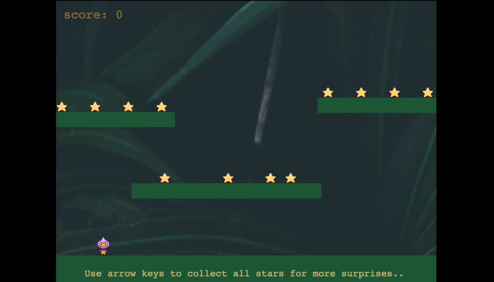
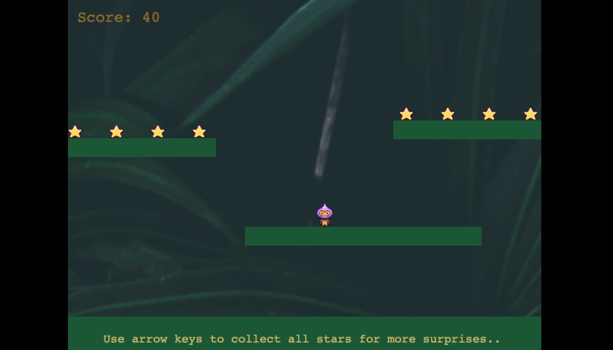
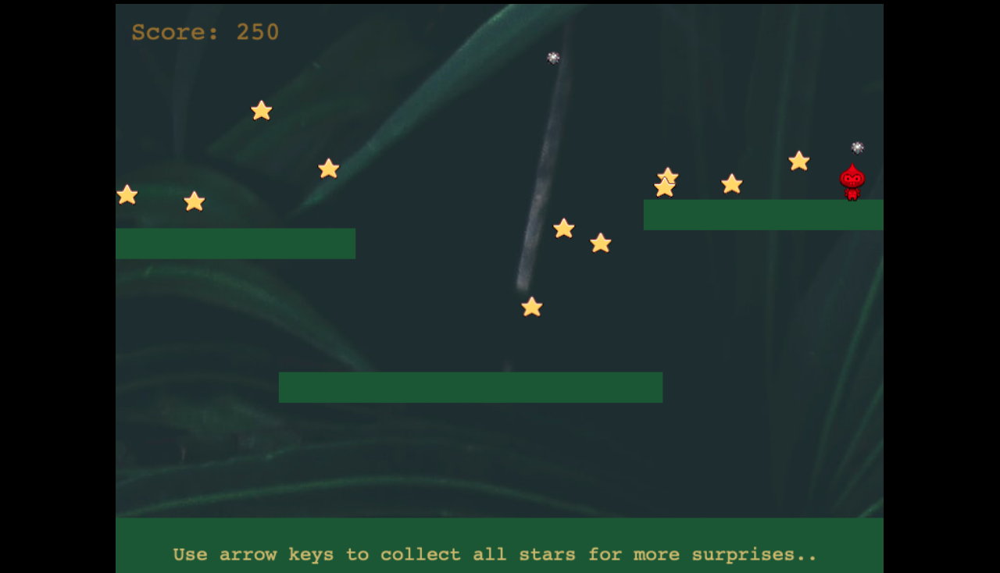

# 🎮 Game Phaser 🎮

- [Deployed version: Play here](https://objective-payne-6a6ac3.netlify.app/)

### 🎮 Preferred Browser - Chrome🎮

  <br/>
  Game Night is a 2D game built to provide a creative playground for users to play, relax and unwind.

---

## 🎮 Prompt🎮

Give the player a challenge: get as high a score as possible without dying!
The idea is this: When you collect all the stars the first time it will release a bouncing bomb. The bomb will just randomly bounce around the level and if you collide with it, you die. All of the stars will respawn so you can collect them again, and if you do, it will release another bomb.

---

## 🎮 How to contribute to this Project?

```shell
git clone https://github.com/mcherry000/pixelated.git
npm install
npm start
```

After cloning the repo, run `npm install` from your project directory. Then, you can start the local development
server by running `npm start`.

After starting the development server with `npm start`, you can edit any files in the `src` folder
and webpack will automatically recompile and reload your server (available at `http://localhost:8080`
by default).

---

## 🎮 Tech Stack:


[][html]

[][css]

[][js]

[][netlify]

[][github]

[][canva]

[][npm]

[][node]

[html]: http://www.w3.org/html/logo/
[css]: http://www.w3.org/html/logo/
[canva]: https://www.canva.com/
[npm]: https://github.com/npm/logos
[node]: https://nodejs.org/en/about/resources/
[netlify]: https://www.netlify.com/press/
[js]: https://github.com/voodootikigod/logo.js
[html]: http://www.w3.org/html/logo/
[github]: https://github.com/logos

## <br/>

---

## 🎮 How to get started?

- [🎮 To Play, click here 🎮](https://objective-payne-6a6ac3.netlify.app/)
  <br/>

---

## 🎮 On clicking, your screen will look like this:



---

## 🎮 Next, collect all stars to unlock next level..



---

## 🎮 Game is over as soon as you get hit by an evil ball.



---

## 🎮 Click refresh in the URL bar to play again.


---

## 👩‍ Created by

| Engineer        | LinkedIn Profile                                | GitHub Profile                |
| --------------- | ----------------------------------------------- | ----------------------------- |
| ☀️ Manika Arora | https://www.linkedin.com/in/manika-a-11692716b/ | https://github.com/mcherry000 |

---
